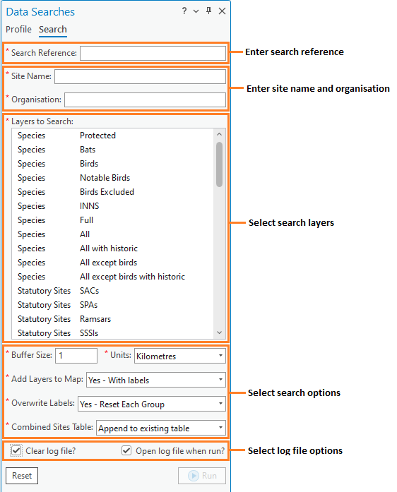

************************
Anatomy of a data search
************************

.. index::
	single: Data search process

This section describes how a typical data search might be carried out manually, and how the Data Searches tool automates this process. Please note that the examples used in this illustration are purely fictional and do not represent a real-world scenario. 

Data search process
===================

The process of a typical data search can be broken down into a number of distinct steps that are described here. In the next section the way that the Data Searches tool carries out these steps is explained.

Entering a search location
	Before any search can be carried out, the point, line or polygon describing the location that the search is centred on has to be entered into the GIS system. Typically this would be held in a single data layer, with some associated attributes such as the search reference or the name of the search site.

Buffering the search site
	Once the search location is entered into the GIS system, it can be used as input into a buffering tool. The user chooses the radius within which the search will be carried out, and buffers the search location using this search radius. The output from this operation is saved as a new GIS data layer.

Selecting the relevant data layers
	Using the buffer layer created in the previous step, each of the data layers describing the presence of protected sites and/or species is selected one by one.

Exporting the results
	The selected features are exported in the format required by the user. This can include both GIS data layers to allow mapping and visualisation, and tabular data for reporting purposes. Labels may be added to the GIS data at this point to aid in the identification of individual sites on any maps that are created. Other columns may need to be added or removed from the tabular data at this point to create the exact output the user requires. If a summary table of the results is needed for the search report, the user has to create this by hand from the exported tables using a spreadsheet or word processing package.

Repeating the process
	For statutory reasons the search radius may vary between (for example) protected sites and protected species. In this case the search needs to be repeated with a new buffer layer each time.

.. raw:: latex

   \newpage

.. index::
	single: Tool components

The Data Searches tool
======================

There are four component parts to the Data Searches tool that work together to automate the process described above:

1. One or more GIS layers that describe the locations of the searches, using a unique search reference number to identify each search request.
#. A tool XML configuration file that specifies how if the user can choose a user XML profile.
#. One or more user XML profiles that specifies how the tool is set up and how data will be saved by default.
#. The Data Searches tool ArcGIS Pro add-in.

The Data Searches tool is used within a GIS environment and requires all the required data layers to be preloaded in the GIS (see :numref:`figInterfaceAnnotated`). 

.. _figInterfaceAnnotated:

	Example of an ArcGIS Pro map configured for the Data Searches tool

.. raw:: latex

   \newpage

Tool workflow
-------------

The Data Searches tool requires minimum user input in order to perform searches once it is configured. The simple workflow is as follows (see :numref:`figUIAnnotated`):

1. The user enters the unique search reference.
2. The user enters the site name and organisation name for this search if required).
#. The user specifies which data layers to search. Only layers that are loaded in the active map are made available for selection.
#. A buffer size is entered and the units for this buffer are specified.
#. The user chooses whether to add any selected GIS layers to the map, and whether (and how) this new data should be labelled.
#. The user selects whether a table combining all the results should be created during the process.
#. The user opts to clear the log file before starting and/or open the log file after completion.
#. Finally, the user clicks **Run** and the process starts.

.. _figUIAnnotated:

	The Data Searches tool workflow

In essence, the process that the tool follows is identical to the manual search process described above. 

1. The search reference is located in the the data layer(s) containing the search location.
#. The location is buffered using the specified radius, resulting in a new data layer that is saved in the output folder.
#. Selections are made on all data layers selected by the user using this buffer layer.
#. The resulting selections are exported to the output folder in the formats specified in the configuration file. At this point, columns may be automatically added, removed or changed, labels may be added to the output, and summary data can be calculated. Output can be saved as tabular data only, or as both tabular and GIS data.
#. If required the output is also added to a summary 'combined sites' table to aid reporting.
#. GIS data is added to the map if specified by the user. Layers are also symbolised, if specified in the configuration file, and labels are added if requested.
#. During the process the tool reports its progress to a log file and, when the process finishes, this log file can be displayed to allow the user to assess the success of the data search. The log file is kept with the other output in the output directory.

.. Note::
   Searches can be based on input GIS layers containing either points, lines or polygons. Multiple features can be present for each unique search reference, but those features can only be present in one of the layers.

.. raw:: latex

   \newpage

.. index::
	single: Tool outputs

Tool outputs
============

Below is an example of the GIS outputs generated from a data search (:numref:`figGISOutputExample`).

.. Note::
   The output layers are grouped and their names refer back to the search reference number. The symbology of the layers is customised, as is the labelling applied to each output layer. Only layers for which a feature was found within the search radius will be included in the output. The buffer that was used for the analysis is also included in the output, as is the original search feature.

.. _figGISOutputExample:

	Example of GIS output from the Data Searches tool

.. raw:: latex

   \newpage

Output folder
-------------

All the GIS and tabular outputs from the tool are stored in a user defined folder (:numref:`figOutputFolderExample`). These outputs **may** include one or more of the following:

- A GIS layer containing the search feature
- A GIS layer containing the buffer that was used
- One or more GIS layers containing the results of the search for each selected input layer
- One or more text files, potentially in different formats, containing the exported results of the search for each selected input layer
- A combined sites table
- The log file

.. _figOutputFolderExample:

.. figure:: figures/ExampleOutputFolder.png
	:align: center

	Example of the Data Searches tool output folder

.. raw:: latex

   \newpage

Output files
------------

GIS layers can be produced, either as an aid to generating maps for the data search or for sending to the requester. GIS layers can also be created containing the original search feature and the buffered search area used for the search.

Tabular outputs are also produced in a text based format (.csv or .txt) and can include the radius of the search area and / or the distance of each feature to the search area (:numref:`figTabularOutputExample`). It is also possible to create summary statistics for any column during the process, which will be included in the tabular output.

.. _figTabularOutputExample:

.. figure:: figures/ExampleTabularOutput.png
	:align: center

	Example of tabular output from the Data Searches tool

A combined sites table can also be produced (see :numref:`figCombinedSitesOutputExample`). This table contains a summary of the all sites that are found within the search area. This output is highly customisable and it is easy to exclude or include layers in this table, and choose what data columns to include, as required. Any summary statistics generated for each layer can be included in this table.

.. _figCombinedSitesOutputExample:

.. figure:: figures/ExampleCombinedSitesTable.png
	:align: center

	Example of a combined sites table

.. raw:: latex

   \newpage

Finally, the log file details each step that was taken during the process, and gives some feedback about the outcome of the process. This includes reporting on the inputs for the search, the number of features that were selected in each data layer, and which data layers did not return any features (:numref:`figLogFileExample`).

.. _figLogFileExample:

.. figure:: figures/ExampleLogFile.png
	:align: center

	Example of a Data Searches tool log file

The following chapters, :doc:`Setting up the tool <../setup/setup>` and :doc:`running the tool <../execute/execute>`, will guide you through setting up and operating the tool in such a way that these tool outputs meet the exact requirements of data searches within your organisation.