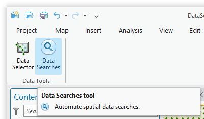
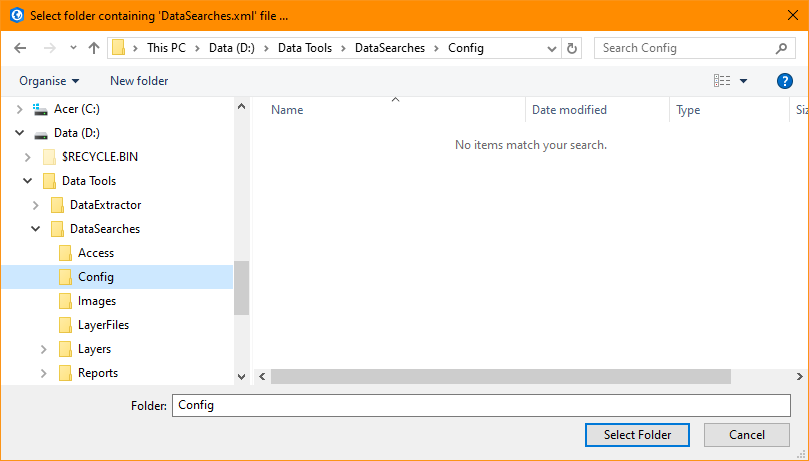
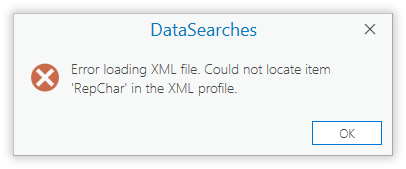
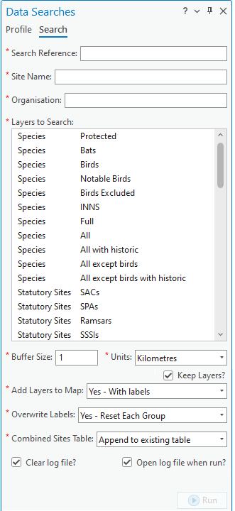
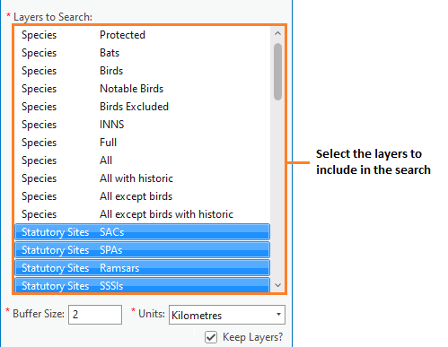
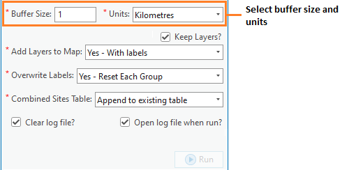
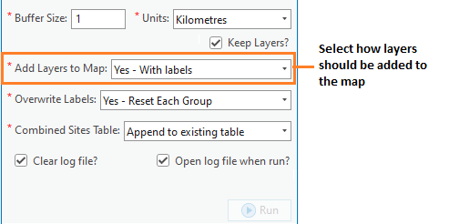
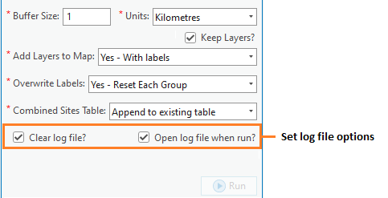

.. index::
	single: Running the tool

****************
Running the tool
****************

Instructions
------------

The operation of the Data Searches tool is explained in this section. While the interface is similar between the ArcGIS Pro, ArcMap and MapInfo implementations of the tool, there are some differences. This user guide is specific to the ArcGIS Pro version of the tool.

As discussed in the :doc:`Setting up the tool <../setup/setup>` section, the Data Searches tool is operated from a GIS project file within which the data required to run the tool is already loaded in the active map window. Therefore, before running the tool, ensure the following conditions are met:

- A GIS profile has been created which contains both the search sites layer(s) and the data layers (containing the sites and species that will be queried) in a map window.
- The search sites layer(s) have a column that contains the unique reference for each search, and this reference has the correct format.
- The tool XML configuration file 'DataSearches.xml' has been set up and is named correctly.
- One or more user XML profiles have been set up and are in the same folder as the tool XML file.
- The Data Searches tool has been installed and set up.

.. seealso::
	Please refer to the :doc:`Setting up the tool <../setup/setup>` section for further information about any of these requirements.

.. raw:: latex

   \newpage

.. index::
	single: Opening the form

Opening the tool
================

To open the Data Searches tool in ArcGIS Pro, open the **Tools** menu bar and click on the **Data Searches tool** button (:numref:`figLaunch`).

.. _figLaunch:

	Launching the Data Searches tool in ArcGIS Pro

.. note::
	Once the tool has been opened the window pane will remain open unless it is manually closed. As with other dockable windows in ArcGIS Pro, the window can docked anywhere in the ArcGIS Pro application and can be pinned or hidden when not in use.

.. raw:: latex

   \newpage

.. index::
	single: Initial set-up

Initial set-up
==============

In order to function, the tool needs to know the location of the XML configuration files. The first time
the tool is run, or whenever the configuration file is moved, the user must specify the folder containing
the XML files.

Click on the 'Open folder' button (:numref:`figOpenXMLFolderButton`).

.. _figOpenXMLFolderButton:

	Click on the Open Folder button

Then navigate to the folder containing the XML files and click OK. If the tool XML file is present and its
structure is correct, the list of user profiles will appear in the drop-down list (:numref:`figSelectConfigFolder`).

.. _figSelectConfigFolder:

	Locating the configuration file folder

.. note::
	The location of the configuration folder will be stored for future use.

.. index::
	single: Loading a profile

Loading a profile
=================

If more than one user XML profile is found, and the tool configuration file is configured to allow the user
to choose the XML profile, then the **Profile** tab will appear to allow the user to choose an XML profile (:numref:`figSelectXMLProfile`).

.. _figSelectXMLProfile:

	Example list of XML profiles to select

Select a profile and click 'Load' to start the tool using that profile. If there are any structural issues
with the selected XML profile, the tool will display a message with the error it has encountered, and not
load any further (:numref:`figLaunchWarning`).

.. _figLaunchWarning:

	Example warning message displayed for any XML structural issues

Provided that the selected XML profile is otherwise correct, the **Search** tab will display 
(:numref:`figDisplayForm`).

.. _figDisplayform:

	The form displaying all of the available search fields and options

.. note::
	If there is only one user XML profile, or if the tool configuration file is configured to **not** allow
	the user to choose the XML profile, then the default XML profile will lead automatically (if found).

If any of the map layers specified in the XML profile are not present in the active map window then a warning message will appear (:numref:`figMissingLayersWarning`).

.. _figMissingLayersWarning:

	Example warning message that one of the layers is missing

A warning message will also appear on the form (:numref:`figMissingLayersWarning2`).

.. _figMissingLayersWarning2:

	Example warning message that one of the layers is missing

.. note::
	Layers missing from the active map will not appear in the 'Layers to Search' list and hence will not be available for selection.

.. raw:: latex

   \newpage

.. index::
	single: Using the form

Using the form
==============

Enter the search reference in the **Search Reference** box. If the search reference is not found in any of the search layers a warning message will appear.

.. _figsearchRefUnknownArcGIS:

	Warning message that search reference is not found

If required, enter the site name and requesting organisation name.

.. note::
	These fields will only appear if the values for the attributes 'RequireSiteName' and 'RequireOrganisation' are set to ``Yes`` in the XML profile.

Select the data layers you wish to include in the search in the 'Layers to Search' list. Use the :kbd:`Ctrl` key to select individual layers, or the :kbd:`Shift` key to select a range of layers. Selected layers will appear highlighted, layers that will not be included remain unselected (:numref:`figSelectLayers`).

.. _figSelectLayersArcGIS:

	Select the layers to include in the search

Next, select the buffer size and units in the Buffer Size and Buffer Units boxes (:numref:`figBufferSettings`). The buffer size box accepts decimal points.

.. _figBufferSettings:

	Select the buffer size and units you wish to use.

.. note::
	If a buffer size of zero (0) is used, the tool will create a buffer polygon of 0.01 metres in order for the processing to progress using a polygon area.

Decide whether you wish to add the results of the search to the screen and select the relevant option in the 'Add Selected Layers to Map' drop-down box. There are three options (:numref:`figLayerSettings`):

.. _figLayerSettings:

	Select how results should be added to the map, if at all

- **No** ... Layers will not be added to the map.
- **Yes - Without labels** ... Layers will be added to the map but will not be labelled.
- **Yes - With labels** ... Layers will be added to the map and will be labelled.

When either of the 'Yes' options is selected, layers will be added to the map in accordance with the settings that are given for each map layer in the configuration document. 

.. note:: 
	If the 'KeepLayer' attribute is set to ``No`` for an individual layer, it will not be added to the map even if the user selects a 'Yes' option in the drop-down list.

If you have selected ``Yes - With labels``, select how labels should be added in the 'Overwrite Map Labels' drop-down box (:numref:`figLabelSettingsArcGIS`). If you have made a different selection in the 'Add Selected Layers to Map' drop-down box, any settings in the 'Overwrite Map Labels' will be ignored.

.. _figLabelSettings:

	Select how labels should be added to the map, if at all

There are three options:

- **No** ... Existing map labels will not be overwritten. However, new map labels will be created if the map label column given in the configuration document doesn't exist.
- **Yes - Reset Each Layer** ... Labels will be numbered from 1 and increase by 1 for each feature. For each new layer the label number will be reset to 1.
- **Yes - Reset Each Group** ...  Labels will be numbered from 1 and increase by 1 for each feature in a layer group. For the first layer in each new layer group the label number will be reset to 1.
- **Yes - Do Not Reset** ... Labels will be numbered from 1 and increase by 1 for each feature, but the counter will increase incrementally for all the layers (i.e. it will not reset to 1 at the start of each layer).

.. note:: 
	A 'layer group' is defined by the inclusion of a hyphen in the layer definition. The part of the layer definition before the hyphen is treated as the group name (see the :ref:`note <group>` on group layers).

.. note::
	Map layers will be labelled in accordance with the settings that are given for each map layer in the configuration document. These settings can override the above options in the following circumstances:

	- If no 'LabelColumn' is given in the configuration file, the map layer will not be labelled in any circumstance.
	- If the 'OverwriteLabels' attribute is set to ``No``, the labels for this map layer will not be overwritten even if requested by the user.

.. note::
	If no default values have been given in the XML file for 'DefaultAddSelectedLayers', 'DefaultOverwriteLabels' or 'DefaultCombinedSitesTable', the drop-downs relating to these options will **not show on the form**. In this case, no layers will be added, no labels overwritten, and no combined sites table created, respectively.

.. raw:: latex

   \newpage

Decide how the combined sites table should be created by selecting the relevant option in the 'Create Combined Sites Table' drop-down box. There are three options (:numref:`figCombinedSites`):

.. _figCombinedSites:

	Select how the combined sites table should be created

- **None** ... No combined sites table will be created. Any existing combined sites table for this search reference will be retained.
- **Append to existing table** ... Records will be appended to the combined sites table (if it already exists), otherwise a new combined sites table will be created.
- **Overwrite existing table** ... Records will be saved to a new combined sites table. If a combined sites table already exists it will be deleted first.

Finally, select whether the log file should be overwritten, and whether the log file should be opened upon completion (:numref:`figClearLogFileArcGIS`). Now the form is set up to run your search.

.. _figLogFileOptions:

	Select options for the log file

.. raw:: latex

   \newpage

Running the search
==================

Once the search details have been entered and the options selected, click **Run**.

While the process is running a progress bar will appear at the bottom of the form providing details of progress (:numref:`figProgressBar`).

.. _figProgressBar:

	The progress bar as the search is running

When the search has finished the log file will be opened (:numref:`figLogFile`), if required, so that you can check the process has completed correctly. The results will be added to the active map.

.. _figLogFile:

	The log file is shown when the search finishes

.. Tip::
	You can now repeat the search process using a different search radius with different data layers, or run for a different search request, as required.

.. _OverwriteWarning:

.. caution:: 
	If you rerun the search process using the **same search reference**, for example with a different buffer size, it is possible that some outputs will overwritten, or duplicated, as follows:

	- Output tables and GIS layers will be overwritten if the same map layer is included in the second search. Only one copy of each output table and / or GIS layer can be saved for the same layer for the same search reference.
	
	- The combined sites table will be overwritten if **Overwrite existing table** is selected in the 'Create Combined Sites Table' option.

	- Combined sites records will be duplicated if the same map layer is included in a second search and if **Append to existing table** is selected in the 'Create Combined Sites Table' option.

.. raw:: latex

   \newpage

.. index::
	single: Search results

Search results
==============

When the search is finished, any exported data tables, saved GIS layers, the search feature GIS layer, the buffer GIS layer, and the log file are all saved in the 'GISFolder' specified in the XML document. Any saved GIS layers resulting from the search are also added to the map interface (if requested).

.. note::
	Only results for those layers for which features were found within the search radius are saved and added to the map. Empty files will not be generated.

Search results are added to the active map as follows:

- If 'Yes' is selected in the 'Add Selected Layers to Map' search option, each saved GIS layer (where 'Yes' is selected in the 'KeepLayer' attribute in the configuration) is added to a new group layer. The name of the group layer follows the 'GroupLayerName' format specified in the XML profile, with any special characters replaced with the 'RepChar' value (e.g. 'LERC/24/001' becomes '001' if the 'GroupLayerName' value is ``%subref%``).

- If either 'Yes - with labels' or 'Yes - without labels' are selected in the 'Add Selected Layers to Map' search option and, if a layer file name is specified in the 'LayerFileName' attribute in the configuration for a saved layer, symbology is applied to that layer using the specified layer file.

- If 'Yes - with labels' is selected in the 'Add Selected Layers to Map' search option and, if a column name is specified in the 'LabelColumn' attribute in the configuration for a saved layer, labels are applied to that layer (as specified in the configuration using the 'LabelClause' attribute).

- A buffer GIS layer, created during the search, will be added to the new group layer and symbology will be applied using the appropriate layer file (as specified in the configuration using the 'BufferLayerName' general attribute).

- Unless the buffer radius specified is zero, the map will zoom to the extent of the buffer layer that was created during the search.

An example of how the results will appear in ArcGIS Pro is shown in :numref:`figResults`.

.. _figResults:

	Example results from search process
