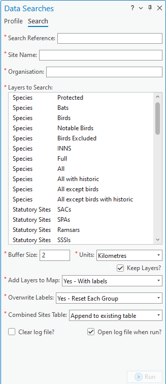

************
Introduction
************

.. index::
	single: Background

Background
==========

Carrying out data searches (i.e. establishing which protected areas or species are present within a set radius of a proposed development) is a routine task for Local Environmental Record Centres (LERCs). The process is a repetitive one, with the same kind of search being carried out each time a search request is received. The requirements for the search are defined by legislation, and the outputs generated for the searches are generally in the same format. Therefore, this is a process that is ideally suited to being automated.

To facilitate performing data searches a new interface was developed - the **Data Searches** tool. The tool was originally developed for use with MapInfo for Greenspace Information for Greater London CIC (GiGL) but is now available for use with MapInfo, ArcMap Desktop and ArcGIS Pro (this version) and is used by a number of LERCs.

.. index::
	single: Overview

Tool overview
=============

The Data Searches tool presents a simple user interface, while being configurable in a highly flexible way according to the requirements of the LERC or individual user. It is integrated into the user interface of the installed GIS application - appearing as an add-in tool button. The tool has a simple interface (:numref:`figUI`), requiring few user inputs and options. The output files can then be used as inputs into a formatted report.

.. _figUI:

	The Data Searches tool interface

.. raw:: latex

   \newpage

The tool uses an existing GIS layer (this can be points, lines or polygons) in the interface to find the geographical location of the search request reference. It then queries selected data layers in the active map window to establish which have features within the specified radius of the location, and then exports this information in a format requested by the user. The output data can be both spatial (as new shapefiles) and/or tabular (as TXT or CSV files). The tool creates a log file for each search which details the steps that were taken during the process. The process is discussed in the section on :doc:`Running the tool <../execute/execute>`.

Defining the way that searches should be carried out, the output that they generate, and the layers that can potentially be included in a search is done via a user configuration file written in XML. Using this file the user can configure all the parts of the search, for example:

* The name of the geographic layer containing the search references, and its key columns.
* The location of the output folder.
* Naming conventions for output files and folders, e.g. how the search reference or site name should be included.
* Defaults for buffer sizes and buffer units.
* For each data layer, a detailed definition of how features should be selected and what data should be output from it.
* Details on the display and labelling of outputs from individual data layers.

An example of the XML file is included in the :doc:`Appendix <../appendix/appendix>`, and the process of setting up this file is discussed in the section on :doc:`Setting up the tool <../setup/setup>`.

.. index::
	single: Overview; Benefits

Benefits
========

There are a number of clear benefits to using the Data Searches tool for carrying out routine data searches.

1. The tool, by encapsulating and automating the process, saves considerable time over carrying out these searches manually.
#. Both the process and the outputs of the search are standardised, therefore minimising the risk of user error that is present in a manual search.
#. Using the tool makes exploration easy, as it allows for the rapid evaluation of 'what if' scenarios (e.g. by varying the search radius, or exploring a number of possible locations).
#. By specifying the outputs of the tool centrally through the configuration file, the output for each search is consistent with all other searches, regardless of the individual carrying out the search. This leads to comparability of results and a predictable experience for the users of a data search service.
#. The searches are repeatable and, through the inclusion of the log file, automatically documented.