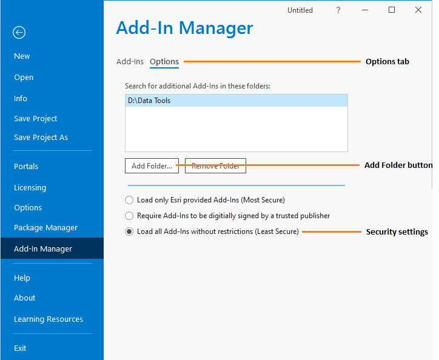

*******************
Setting up the tool
*******************

Before the Data Searches tool will function, it needs to be installed and configured. It is recommended that the configuration is carried out first, although the steps are interchangeable. 

.. index::
	single: Configuring the tool

Configuring the tool
====================

There are two configuration files used by the tool. They must be in the same folder.

Tool configuration file
-----------------------

This configuration file must be named 'DataSearches.xml' and it must be present for the tool to load. It allows the user to control which configuration file to load, and contains just three settings:

ChooseXML
	Is the user allowed to choose their own configuration file? (Yes/No)

DefaultProfile
	What the default XML file called is called. If blank, the tool looks for DefaultProfile.xml.

HelpURL
	The URL of the online user guide (this guide).

.. caution:: 
	The name of this configuration file must be 'DataSearches.xml'. The tool will not load if the file is not found.

User configuration profiles
---------------------------

These configuration files must be in the same folder as the tool configuration file. There can be as many profiles as you wish, each with different options and default settings. Each file contains all of the user options and default settings for the tool including, where files are kept, which SQL Server to connect to, which SQL Server tables to make available and other general settings. Attributes and settings are presented as nodes (beginning with a start node, e.g. ``<example>``, and finishing with an end note, e.g. ``<\example>``), with the value for the setting held between the ``<value>`` and ``<\value>`` tag. 

.. note::
	The XML profiles can have any name prefix as long as they have a '.xml' file extension.

The XML file can be edited in a text editor such as Notepad. It is split into two sections:

_`General attributes`
	General and default attributes for the tool.

_`Data layers`
	Deals with the way each data layer should be handled. This structure is the same for both implementations of the tool.

.. caution::
	It is important that the structure of the file is maintained as it is presented in the :doc:`Appendix <../appendix/appendix>`. Any changes to the structure may result in the Data Searches tool not loading, or not working as expected.

Once editing has been completed and the edits have been saved, it is recommended that the configuration file is opened using an internet browser such as Edge which will help highlight any editing errors – only if the structure of the file is valid will the whole file be displayed in the internet browser.

.. note::
	It is recommended that the configuration file is kept in a central (network) location, so that all users use the same configuration.

.. raw:: latex

   \newpage

.. index::
	single: General attributes

General attributes
******************

The first section of the configuration file deals with a series of general attributes for the Data Searches tool. These general nodes specify where files are kept, how output files should be named and other overall settings. Details on these attributes (and their typical values where known) are given below. The list follows the order within which the attributes are found in the configuration file. This version of the configuration details is valid for the ArcGIS version 2.1 of the Data Searches tool.

.. note::
	The enquiry reference takes the form 'LERCName/Year/EnquiryNumber' (e.g. 'XYBRC/2016/001'). Within the configuration file, it is possible to use all or parts of this reference for naming files and folders. The following options are available:

	- ``%ref%`` uses the full enquiry reference.
	- ``%shortref%`` uses the numeric part of the reference (e.g. '2016/001').
	- ``%subref%`` uses the Enquiry Number (e.g. '001').
	- ``%sitename%`` uses the name of the site (e.g. 'Example site').

DatabasePath
	Currently not used but must exist in XML.

DatabaseTable
	Currently not used but must exist in XML.

DatabaseRefColumn
	Currently not used but must exist in XML.

DatabaseSiteColumn
	Currently not used but must exist in XML.

DatabaseOrgColumn
	Currently not used but must exist in XML.

RequireSiteName
	A Yes/No attribute that defines whether the site name must be entered. If this attribute is blank the 'Site Name' field won't appear on the form and won't be required.

RequireOrganisation
	A Yes/No attribute that defines whether the organisation must be entered. If this attribute is blank the 'Organisation' field won't appear on the form and won't be required.

UpdateTable
	Whether the search table should be updated with the site name, organisation and search radius values?

RepChar
	The character(s) used to replace any special characters in file or folder names. 'Special' characters are any of the following: ``\, %,$, :, *, /, ?, <, >, |, ~, £, .``. The replacement character can itself not be a special character.

_`LayerFolder`
	The folder where layer files (``.lyrx``) are kept. These files are used to symbolise the GIS data layers that are exported during processing.

SaveRootDir
	The file location where all data search folders are stored.
 
SaveFolder
	The name of the folder that will be created for each search. The keywords ``%ref%``, ``%shortref%``, ``%subref%``and ``%sitename%`` are allowed.

GISFolder
	The name of the folder where all data generated by the Data Searches tool will be stored. This folder will be created in the SaveFolder. The keywords ``%ref%``, ``%shortref%``, ``%subref%`` and ``%sitename%`` are allowed.

LogFileName
	The name of the log file that will be created during processing. The keywords ``%ref%``, ``%shortref%``, ``%subref%``and ``%sitename%`` are allowed.

PauseMap
	A Yes/No attribute that defines whether the map processing should be paused during processing?

DefaultClearLogFile
	A Yes/No attribute that defines whether the check box for 'Clear Log File?' on the interface should be set to checked (``Yes``) or unchecked (``No``) when the form is opened.

DefaultOpenLogFile
	A Yes/No attribute that defines whether the check box for 'Open Log File?' on the interface should be set to checked (``Yes``) or unchecked (``No``) when the form is opened.

DefaultBufferSize
	The default buffer size that will appear in the 'Buffer Size' text box when the form is opened.

BufferUnitOptions
	The options for buffer units that will be shown in the 'Buffer Unit' drop-down list. It is not recommended that these are changed.

DefaultBufferUnit
	The buffer unit that should be shown by default in the 'Buffer Unit' drop-down list. This attribute is the index number of the unit in the drop-down list, with 1 being the first option.

KeepBufferArea
	A Yes/No attribute that defines whether a GIS file of the buffer area should be kept.

BufferPrefix
	The prefix output name for the buffer GIS file. The size of the buffer will be added automatically. The keywords ``%ref%``, ``%shortref%``, ``%subref%``and ``%sitename%`` are allowed.

BufferLayerName
	The name of the layer file (kept in the `LayerFolder`_) which will be used to symbolise the buffer layer. Must include the ``.lyrx`` extension.

SearchLayer
	The name of the data searches GIS layer in the interface. There may be either a single search layer (of either points, polygons or lines) of this name, or there may be multiple search layers present (e.g. one of each format) in which case their names should begin with the SearchLayer entry. See :numref:`figInterfaceAnnotated` for an example. In the case of this example, the entry for this node is ``Enquiry_Site`` and the `SearchLayerExtensions`_ entry (see next attribute) is ``_Point;_Line;_Poly``. 

_`SearchLayerExtensions`
	If multiple search layers are used, this node should contain a list of the extensions for each layer, delimited by semicolons (e.g. in the example used above, the entry was ``_point;_poly;_line``). If only a single layer is used this attribute should be left blank.

SearchColumn
	The column name in the search layer that holds the search reference.

SiteColumn
	The column name in the search area layer used to store the site name.

OrgColumn
	The column name in the search area layer used to store the organisation.

RadiusColumn
	The column name in the search area layer used to store the radius.

KeepSearchFeature
	A Yes/No attribute defining whether the feature used in the search should be kept as a GIS file.

SearchOutputName
	The name of the GIS file that the search feature should be exported to. The keywords ``%ref%``, ``%shortref%``, ``%subref%``and ``%sitename%`` are allowed.

SearchSymbologyBase
	The base name of the search layer symbology file (without the ``.lyrx`` extension). Note the relevant extension (from `SearchLayerExtensions`_) will be added. This layer file is used to set the symbology for the saved feature.

AggregateColumns
	A list, delimited by semicolons, of the fields in the search layer that should be used to dissolve the buffer during processing. This attribute can be used in cases where the search sites are multi-part features which may create a number of overlapping buffers rather than one continuous one.

AddSelectedLayersOptions
	The options that should be shown in the 'Add Selected layers to Map' drop-down list. These options should not be changed.

DefaultAddSelectedLayers
	The default option for adding the selected layers that should be shown when the form opens. This attribute is the index number of the item in the 'Add Selected Layers to Map' drop-down list, with 1 being the first option. If no value is entered the list box will be hidden and no layers will be added to the map.

_`GroupLayerName`
	The name of the group layer that will be created in the ArcGIS Table of Contents, under which the results of the data search will be kept. The keywords ``%ref%``, ``%shortref%``, ``%subref%``and ``%sitename%`` are allowed.

OverwriteLabelOptions
	The options that should be shown in the 'Overwrite Map Labels' drop-down list. These options should not be changed.

DefaultOverwriteLabels
	The default option for the 'Overwrite Map Labels' drop-down that should be shown when the form opens. This attribute is the index number of the item in the drop-down list, with 1 being the first option. If no value is entered the list box will be hidden and labels will not be overwritten.

_`AreaMeasurementUnit`
	The units that any area measurements will be done in. Choose from Ha, Km2 and m2. The Default if left blank is Ha.

CombinedSitesTableOptions
	The options that should be shown in the 'Create Combined Sites Table' drop-down list. These options should not be changed.

DefaultCombinedSitesTable
	The default option for the 'Create Combined Sites Table' drop-down that should be shown when the form opens. This attribute is the index number of the item in the drop-down list, with 1 being the first option. If no value is entered the list box will be hidden and no combined sites table will be created.

CombinedSitesTable
	This section defines the combined sites table. It has the following entries:
	
	Name
		The name of the combined sites table. The keywords ``%ref%``, ``%shortref%``, ``%subref%``and ``%sitename%`` are allowed.
	Columns
		A comma-delimited list of the column headings that the combined sites table should have.
	Format
		The format that the combined sites table should have. Choose from ``csv`` or ``txt``.

.. index::
	single: Map layer attributes

Map layer attributes
********************

All map layer attributes are found within the ``<MapLayers>`` node. For each data layer that can be included in the searches, a new child node is created that has the name of the layer (e.g. ``<Sites_-_SSSIs>``). This name is name of the layer as it will be shown in the tool menu, and can be different from the layer name as it is shown in the ArcGIS table of contents (which will be set in a subsequent child node). A simple example of a map layer definition with limited attributes is shown in :numref:`figXMLExampleArcGIS`. 

.. tip::
	If you wish to display spaces in any layer names in the tool menu use an underscore (``_``) for each space in the node name for the layer. XML does not allow spaces in node names, but the tool will translate these underscores into spaces when the form is opened.

.. note::
	If you wish to _`group` layers into functional groups (which can be labelled together), use a hyphen (``-``) to give the group name before the name of the layer in naming the child node (e.g. in ``<Sites_-_SSSIs>``, 'Sites' would be the group name). 

The attributes that are required for each map layer are as follows:

LayerName
	The name of the layer as it is shown in the GIS interface. Characters that cannot be included in the layer name are ``/`` and ``&`` as they will cause the tool to fail. The characters ``-``, ``_``, ``+`` and ``\`` are permitted.

_`GISOutputName`
	The GISOutputName will be used to name any GIS layer that is exported from this data layer during the search. The keywords ``%ref%``, ``%shortref%``, ``%subref%``and ``%sitename%`` are allowed.

TableOutputName
	The TableOutputName will be used to name any tabular file that is exported from this data layer during the search. The keywords ``%ref%``, ``%shortref%``, ``%subref%``and ``%sitename%`` are allowed.

Columns
	A comma-separated list of columns that should be included in the tabular data exported from this data layer during the search. The column names are case sensitive and should match the column names in the source layer. Area, Distance and Radius columns may be included by adding the keywords 'Area', Distance' and 'Radius' (but note the remark about pre-existing area fields in the `IncludeArea`_ node). If results from any aggregate functions are to be included, they should follow the naming convention that ArcGIS employs for statistics fields, as follows:

	- Column names are up to 10 characters long and are case sensitive.
	- Statistics column names are made up of the statistic requested (e.g. COUNT, SUM, MEAN, FIRST, etc.), the underscore character (``_``), and the name of the column to which the statistic applies (e.g. ``COUNT_Year``). Names longer than 10 characters are abbreviated. 
	- If, due to abbreviation, two output columns would be given the same name, ArcGIS will automatically add a count of ``_1`` to the column name. Where the column name is nine or ten characters long, it will replace the last one or two characters of the second column with ``_1``, always ensuring the length of the column name does not exceed ten characters. 
	- Numbering for any subsequent columns with the same name will follow this format adding one to each column number until this number reaches 9. Any subsequent columns will be numbered ``_10``, ``_11`` etc, so adding or replacing up to three rather than two characters in the column name. Again in all cases the new column name will be ten characters long or less.

	.. tip::
		If you are unsure what the output column names will be from an aggregation operation, run the Dissolve tool (this resides in the ArcGIS toolbox, under Data Management Tools => Generalisation) on a sample of your data, and include the statistics columns with the relevant statistic types as you intend to use them in the Data Searches tool. The output will contain the column names as they will be generated by the Data Searches tool, since it uses the same process.

_`GroupColumns`
	A comma-separated list of the name(s) of any column(s) that should be used for grouping the outputs from the search on this layer. The column names are case sensitive and should match the column names in the source layer.

_`StatisticsColumns`
	Statistics may be requested from any columns in the input layer whether `GroupColumns`_ is specified or not. The format of this attribute is as follows: ``ColumnName1;STATISTIC$ColumnName2;STATISTIC``, e.g. ``Area;SUM$Year;COUNT``. Note that in order to be included in the tabular output, the output columns for these statistics must be included in the Columns list as described above. If no `GroupColumns`_ have been defined, the statistics are calculated across the entire output.

OrderColumns
	A comma-separated list of columns by which the results should be ordered in the tabular output for this layer. The order of this list overrides any order in the `GroupColumns`_ attribute.

Criteria
	Selection criteria that should be used on the data layer during the search. These can be used to, for example, suppress confidential records, report on particular species only, or only include records after a certain date. The criteria take the form ``ColumnName Operand Value`` and may include ``AND`` and ``OR`` statements and similar. String values should be enclosed in single quotes. An example might be ``Name = 'myName' AND Year > 2010``. Only records that match the criteria will be exported.

	.. note::
		Any clause specified here must adhere to ArcGIS SQL syntax as the clause will be run within ArcGIS.

_`IncludeArea`
	A Yes/No attribute that defines wether an area calculation should be included in the analysis. If `OutputType`_ is set to``Clip``, areas will be calculated for the clipped polygons. The values are calculated in a column called 'Area' and the results can be added to the tabular output by using the keyword 'Area' in the Columns list. Note that if a column called Area is already present in the input layer, this will be used for the calculations. In this case, it is important to use the correct case for the column name (e.g. if the field is called AREA, the full caps must be maintained). Areas can only be calculated for layers that have polygon topology, and the tool accounts for this.

_`IncludeDistance`
	A Yes/No attribute that defines whether the distance of each feature in the data layer to the search location will be measured during the process. The results can be added to the tabular output by using the keyword 'Distance' in the Columns list.

_`IncludeRadius`
	A Yes/No attribute that defines whether the buffer radius that was used will be available for inclusion to the tabular output during the process. The results can be added to the tabular output by using the keyword 'Radius' in the Columns list. 

KeyColumn
	The name of the column containing the unique identifier for this data layer.

Format
	The format of tabular output exported from this data layer during a search. Options are ``csv`` and ``txt``. If ``txt`` is selected as a format no column names will be included in the output. They are included for ``csv`` output.

KeepLayer
	A Yes/No attribute that defines whether a GIS data layer should be kept of the features selected in this map layer during the search. If ``No`` is entered all geographical data generated for this data layer during the process will be deleted. If ``Yes`` is entered, a data layer will be created that is named according to the `GISOutputName`_ attribute.

	.. note:: 
		If no features are selected in a data layer during a search, no new data layer will be created even if the KeepLayer attribute is set to ``Yes``.

_`OutputType`
	Whether the layer that is kept should be selected by (``Copy``), clipped (``Clip``), overlaid (``Overlay``) or intersected (``Intersect``) the search area.

	.. note:: This attribute affects area calculations; if it is set to 'Clip', any areas calculated will be those of the clipped area, even if the layer is not kept subsequently.

LoadWarning
	A Yes/No attribute that defines whether a warning should be issued if this layer is not loaded in ArcGIS.

PreSelectLayer
	A Yes/No attribute that defines whether this layer should be highlighted by default when the tool menu is loaded.

DisplayLabels
	A Yes/No attribute that defines whether the defined labels should be switched on when displayed.

_`LayerFileName`
	The name of the layer file (``.lyrx``) that should be used to symbolise any GIS output from this data layer. The layer file should be present in the `LayerFolder`_ specified in the general attributes. This name is case sensitive. If no value is entered the system will use the default symbology assigned during processing.

	.. note::
		If a layer file is defined in LayerFileName, any settings defined applying to labels for this layer (i.e. `LabelColumn`_ and `LabelClause`_) will be overridden. Instead, the tool will apply the labels in the way they are defined in the layer file, including the column that should be used for labelling.

OverwriteLabels
	A Yes/No attribute that specifies whether the labels in this data layer can be overwritten for any GIS output. If the attribute is set to ``No``, labels will not be overwritten even if requested by the user through the 'Overwrite Map Labels' options on the form.

_`LabelColumn`
	The name of the column in this data layer that contains the labels. If this entry has a column name that does not exist in the data layer, the tool will create this label column when necessary even if OverwriteLabels is set to ``No``. In this case, the features will be automatically numbered and numbering will follow the rule that is selected by the user through the 'Overwrite Map Labels' options on the form. If this attribute is left blank, no labels will be created or displayed for this layer even when requested by the user. 

_`LabelClause`
	A complex clause that defines the format, font type, font size and colour of the labels for this layer. The format of this clause is as follows:

		``Font:FontName$Size:FontSize$Red:PercentRed$Green:PercentGreen$Blue:PercentBlue$Overlap:Allow``. An example would be ``Font:Arial$Size:10$Red:0$Green:0$Blue:0$Overlap:Yes``. If no clause is filled in these default settings are applied (Font=Arial, Size=10, Red=0, Green=0, Blue=0, Overlap=Yes). 

CombinedSitesColumns
	A comma-separated list of column names to be included in the combined sites table. If this entry is left blank the data layer will not be included in the combined sites table. A number of special cases apply to this attribute:

	- Any entry surrounded by double quotes (e.g. ``"Protected sites"``) will be included in the combined sites table 'as is'. So, in the case of this example, each row that is added to the combined sites table from this data layer will have the entry 'Protected sites' in one of the columns. This feature is useful in distinguishing which data layer each row in the combined sites table originates from. 

	- If `IncludeDistance`_ is set to ``yes``, the keyword ``Distance`` can be included as a column name. The tool will automatically include the calculated distance of each feature to the point of interest in the combined sites table. Similarly the keyword ``Radius`` can be included if `IncludeRadius`_ is set to ``yes``. This will then add the buffer radius that was used for each entry in the table.

	.. note:: 
		The column headings of the combined sites table follow the 'Columns' entry under the CombinedSitesTable attribute in the general attributes. It is important to ensure that the CombinedSitesColumns are given in the same order as expected by this attribute.

_`CombinedSitesGroupColumns`
	A comma-separated list of column names by which the output from this data layer should be grouped before inclusion in the combined sites table. 

_`CombinedSitesStatisticsColumns`
	If any aggregation is applied for this data layer (through the `CombinedSitesGroupColumns`_ attribute), statistics may be included in the combined sites table in the same way as described for `StatisticsColumns`_.

_`CombinedSitesOrderByColumns`
	A comma-separated list of column names by which the output of this layer should be ordered before inclusion in the combined sites table. This entry overrides any ordering created by the `CombinedSitesGroupColumns`_ attribute.

.. caution::
	All entries in the configuration file are **case sensitive**. Most common errors in the setting up of the tool are caused by using the incorrect case for entries.

.. index::
	single: Special characters in XML

.. raw:: latex

   \newpage

Special characters in XML
-------------------------

The characters ``&``, ``<`` and ``>`` are not valid within values and, so in order to be used, must be **escaped** with XML entities as follows:

<
	This must be escaped with ``&lt;`` entity, since it is assumed to be the beginning of a tag. For example, ``RecYear &lt; 2010``

>
	This should be escaped with ``&gt;`` entity. It is not mandatory -- it depends on the context -- but it is strongly advised to escape it. For example, ``RecYear &gt; 1980``

&
	This must be escaped with ``&amp;`` entity, since it is assumed to be the beginning of a entity reference. For example, ``TaxonGroup = 'Invertebrates - Dragonflies &amp; Damselflies'``

.. raw:: latex

   \newpage

.. index::
	single: Installation

Installing the tool
===================

Installing the tool in ArcGIS Pro is straightforward. There are two ways it can be installed:

.. note::
	Before installing the tool you will need to install another ArcGIS Pro add-in 'DataToolbar'. This add-in with simply create a new 'Tools' toolbar onto which the Data Selector tool and other Data tools will be added once installed. To install the toolbar follow the instructions below using  the DataToolbar add-in.

Installation through Windows Explorer
-------------------------------------

Open Windows Explorer and double-click on the ESRI Add-in file for the Data Searches tool (:numref:`figInstallTool`).

.. _figInstallTool:

.. figure:: figures/AddInInstall.png
	:align: center

	Installing the Data Searches tool from Windows Explorer

.. raw:: latex

   \newpage

Installation will begin after confirming you wish to install the tool on the dialog that appears (:numref:`figConfirmInstall`).

.. _figConfirmInstall:

	Installation begins after clicking 'Install Add-in'

Once it is installed, it will appear in the Add-In Manager and on the 'Tools' menu bar.

.. note::
	The 'Tools' menu bar will only appear once the DataToolbar add-in has also been installed.

.. caution::
	In order for this process to work all running ArcGIS Pro sessions must be closed. The tool will not install or install incorrectly if there are copies of ArcGIS Pro running.

.. raw:: latex

   \newpage

Installation from within ArcGIS Pro
-----------------------------------

Firstly, open ArcGIS Pro and go to the Add-In Manager through the Project menu (:numref:`figOpenAddInManager`).

.. _figOpenAddInManager:

.. figure:: figures/StartAddInManager.png
	:align: center

	Starting the ArcGIS Add-In Manager

.. raw:: latex

   \newpage

If the Data Searches tool is not shown, use the **Options** tab to add the folder where the tool is kept (:numref:`figAddInOptions`). The security options should be set to the lowest setting as the tool is not digitally signed.

.. _figAddInOptions:

	The 'Options' tab in the ArcGIS Pro Add-In Manager

.. note::
	Adding a network folder in the options tab will mean that all ArcGIS Pro add-ins in that folder, and all sub-folders, will be loaded when ArcGIS Pro starts.

After restarting ArcGIS Pro the tool will show in the Add-In Manager (:numref:`figAddInManager`) and on the 'Tools' menu bar.

.. _figAddInManager:

	The ArcGIS Pro Add-In Manager showing the Data Searches tool

.. note::
	The 'Tools' menu bar will only appear once the DataToolbar add-in has also been installed.

